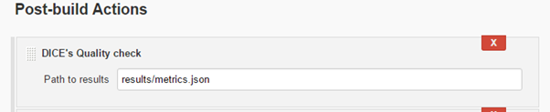
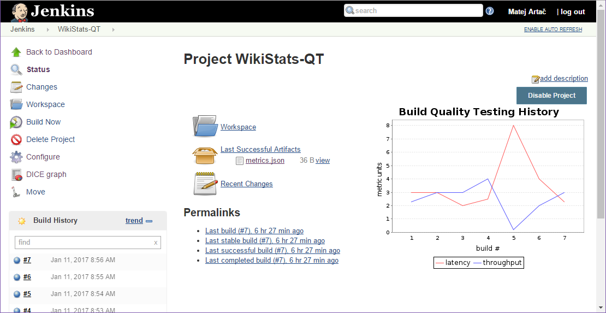
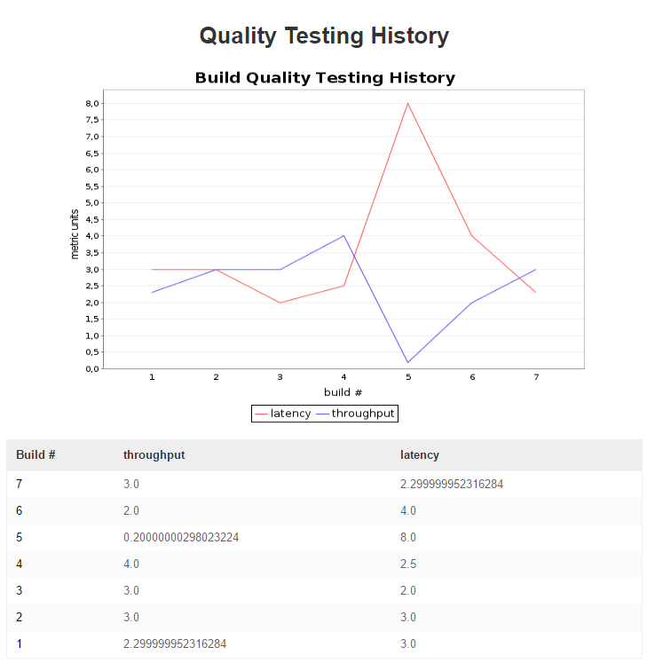

# Using DICE Continuous Integration

The DICE Continuous Integration provides a Jenkins plug-in. It works as a
post-build action, so it only becomes visible in the Jenkins projects, which
1) enable this action, and 2) the build results include a JSON file containing
some performance metric. The metrics can be any valid JSON keys with numeric
values. The following is a valid example of a result that the plug-in can use:

```json
{ "latency": 2.3, "throughput": 3 }
```

## Enabling DICE Jenkins plug-in

* Create a freestyle type project.
* Configure the project as needed, e.g., by setting it to be a VCS project.
* Configure the needed build actions. The result of the build action, when it
  succeeds, has to create a `.json` file in the project's workspace. For
  instance, it might write a `results/metrics.json` file.
* Add a Post-build Action named **DICE's Quality history**.
* Fill in the **Path to results** field with the expected path of the results
  of the project, e.g., `results/metrics.json`.



## Viewing metrics history

Here we assume that the project's job had had multiple successful runs. In each
build, a results file with metrics describing the build's run would be created.
The DICE Jenkins plug-in stores the metrics for each build.

By opening the page of the project's status, we can see a chart showing the
metric values for the past builds:



A more detailed history view is available by clicking on the **DICE graph**
link from the left-side navigation. This view shows a bigger chart and a table
of the history:


